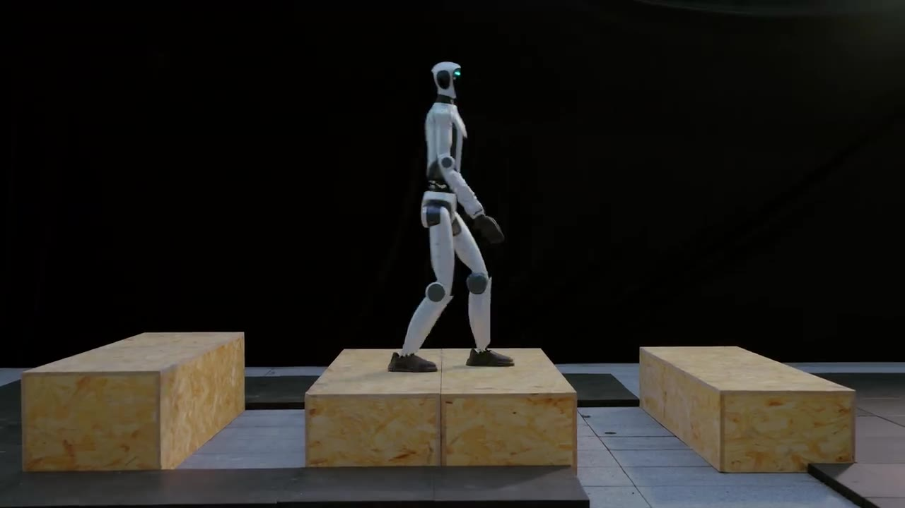

<h1 align="center">
  <i>Now You See That</i>
</h1>

<h3 align="center">
  Learning End-to-End Humanoid Locomotion from Raw Pixels
</h3>

<p align="center">
  <a href="#"></a>
</p>

<p align="center">
  <a href="https://arxiv.org/abs/2602.06382"></a>
  <a href="https://hellod035.github.io/Now_You_See_That/"></a>
  <a href="https://www.bilibili.com/video/BV1ApcXzGEkP/"></a>
</p>

<p align="center">
  <a href="https://github.com/Hellod035">Wandong Sun</a><sup>1,2,*</sup> &nbsp;·&nbsp;
  <a href="#">Yongbo Su</a><sup>1,2,*</sup> &nbsp;·&nbsp;
  <a href="#">Leoric Huang</a><sup>2,*</sup> &nbsp;·&nbsp;
  <a href="#">Alex Zhang</a><sup>2</sup> &nbsp;·&nbsp;
  <a href="#">Dwyane Wei</a><sup>2</sup> &nbsp;·&nbsp;
  <a href="#">Mu San</a><sup>2</sup> &nbsp;·&nbsp;
  <a href="#">Daniel Tian</a><sup>2</sup>
  <br/>
  <a href="#">Ellie Cao</a><sup>2</sup> &nbsp;·&nbsp;
  <a href="#">Baoshi Cao</a><sup>1</sup> &nbsp;·&nbsp;
  <a href="#">Yang Liu</a><sup>1</sup> &nbsp;·&nbsp;
  <a href="#">Finn Yan</a><sup>2,†</sup> &nbsp;·&nbsp;
  <a href="#">Ethan Xie</a><sup>2,†</sup> &nbsp;·&nbsp;
  <a href="#">Zongwu Xie</a><sup>1,†</sup>
</p>

<p align="center">
  <sup>1</sup> Harbin Institute of Technology &nbsp;&nbsp;&nbsp; <sup>2</sup> HONOR Robotics Team
  <br/>
  <sub><sup>*</sup> Equal contribution &nbsp;&nbsp; <sup>†</sup> Corresponding authors</sub>
</p>

---

<p align="center">
  <a href="https://www.bilibili.com/video/BV1ApcXzGEkP/" title="Watch the promo video on Bilibili">
    
  </a>
  <br/>
  <sub>▶︎ Click the cover to watch the promo video on Bilibili</sub>
</p>

---

## Overview

We present an end-to-end framework for vision-driven humanoid locomotion that takes raw depth pixels as input and produces robust whole-body control across diverse, challenging terrains.

- **High-fidelity depth simulation** captures stereo matching artifacts and calibration uncertainty, closing the sim-to-real gap.
- **Vision-aware behavior distillation** aligns latent spaces and adds noise-invariant auxiliary tasks for effective transfer from privileged height maps to noisy depth.
- **Terrain-specific reward shaping** with multi-critic and multi-discriminator learning lets a single policy handle stairs, gaps, platforms, debris, and more.

The resulting policy runs on two humanoid platforms with different stereo depth cameras, handling extreme challenges such as high platforms, wide gaps, and bidirectional long-term staircase traversal.

## Links

- 📄 **Paper** — [arXiv:2602.06382](https://arxiv.org/abs/2602.06382)
- 🌐 **Project page** — [hellod035.github.io/Now_You_See_That](https://hellod035.github.io/Now_You_See_That/)
- 📺 **Video** — [YouTube](https://youtube.com/shorts/hC3Otwjjil8) · [Bilibili](https://www.bilibili.com/video/BV1PmPJzoERx/)
- 🎬 **Promo** — [Bilibili](https://www.bilibili.com/video/BV1ApcXzGEkP/)

## Citation

If you find this work useful, please cite:

```bibtex
@misc{sun2026thatlearningendtoendhumanoid,
      title={Now You See That: Learning End-to-End Humanoid Locomotion from Raw Pixels},
      author={Wandong Sun and Yongbo Su and Leoric Huang and Alex Zhang and Dwyane Wei and Mu San and Daniel Tian and Ellie Cao and Baoshi Cao and Yang Liu and Finn Yan and Ethan Xie and Zongwu Xie},
      year={2026},
      eprint={2602.06382},
      archivePrefix={arXiv},
      primaryClass={cs.RO},
      url={https://arxiv.org/abs/2602.06382},
}
```
